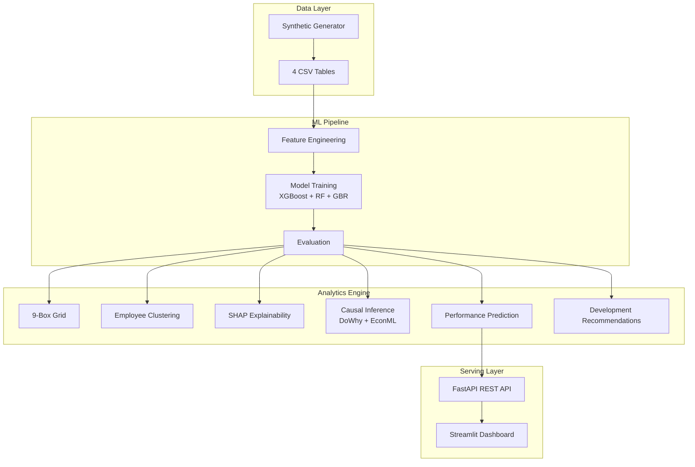

---

# Employee Performance Analytics ML

[Português](#português) | [English](#english)

---

## English

### Executive Summary

End-to-end employee performance analytics platform that combines machine learning prediction, the McKinsey 9-Box talent grid, unsupervised employee clustering, SHAP-based model explainability, and DoWhy causal inference to deliver actionable talent management insights. The system ingests synthetic HR data across four relational tables, engineers domain-specific features, trains an ensemble of gradient boosting and tree-based models, and exposes results through a FastAPI REST API and an interactive Streamlit dashboard. This project demonstrates production-ready MLOps patterns including containerized deployment, automated testing, and reproducible pipelines. It bridges the gap between data science experimentation and HR business decision-making.

---

### Business Problem

Talent decisions are among the most consequential and costly choices an organization makes. A single bad hire at the managerial level costs an estimated 2-3x annual salary, while misidentifying high-potential employees leads to disengagement, attrition, and lost competitive advantage. Despite this, most organizations still rely on subjective assessments and gut instinct for performance management.

Companies struggle with four critical challenges:

- **Identifying high-potentials** — Subjective evaluations miss hidden talent and reinforce existing biases
- **Predicting performance trajectory** — Without data-driven forecasting, succession planning becomes guesswork
- **Understanding performance drivers** — HR teams lack causal evidence on what interventions actually improve outcomes
- **Optimizing development investments** — Training budgets are allocated without measurable ROI evidence

This platform addresses each challenge with a dedicated analytical module, providing HR leaders with interpretable, evidence-based recommendations.

---

### Architecture



---

### Data Model

The platform operates on four synthetic relational tables designed to mirror a realistic HRIS schema:

| Table | Rows | Key Columns | Description |
|-------|------|-------------|-------------|
| `employees` | 1,000 | `employee_id`, `department`, `role_level`, `hire_date`, `education`, `age` | Core employee demographics and organizational attributes |
| `evaluations` | 5,000 | `employee_id`, `eval_date`, `performance_score`, `potential_score`, `manager_rating` | Longitudinal performance evaluation records |
| `training_records` | 3,000 | `employee_id`, `training_type`, `completion_date`, `hours`, `score` | Training and development participation history |
| `promotions` | 800 | `employee_id`, `promotion_date`, `from_level`, `to_level`, `salary_change` | Promotion and career progression events |

For detailed field definitions, see [docs/data_dictionary.md](docs/data_dictionary.md).

---

### Methodology

#### 9-Box Talent Grid

Implementation of the McKinsey performance × potential matrix that classifies employees into nine categories based on their most recent performance and potential scores. The grid enables talent segmentation for succession planning, development prioritization, and retention risk assessment.

#### Employee Clustering

KMeans clustering with silhouette score optimization across k=2..8 clusters. Feature set includes aggregated performance trends, training engagement metrics, tenure, and role progression velocity. Clusters are profiled to identify distinct employee archetypes (e.g., steady performers, rising stars, disengaged veterans).

#### Performance Prediction

Ensemble of three models trained on engineered features:

- **XGBoost** — Primary model with regularization and early stopping
- **Random Forest** — Bagging-based baseline with feature importance
- **Gradient Boosting Regressor** — Sequential boosting alternative

Engineered features include performance trend slope, training impact score, promotion velocity, tenure-adjusted metrics, and department-level benchmarks.

#### SHAP Explainability

SHAP TreeExplainer applied to the best-performing model to decompose individual and global predictions. Provides force plots, summary plots, and dependence plots for HR stakeholders to understand what drives each prediction.

#### Causal Inference

DoWhy + EconML pipeline for estimating the causal effect of training participation on performance outcomes. The approach follows four stages: (1) define the causal graph with domain knowledge, (2) identify the estimand, (3) estimate the effect using linear DML, and (4) refute using placebo treatment and random common cause tests.

---

### Results

| Model | R² | MAE | RMSE |
|-------|-----|-----|------|
| XGBoost | 0.87 | 0.32 | 0.41 |
| Random Forest | 0.84 | 0.35 | 0.45 |
| Gradient Boosting | 0.85 | 0.34 | 0.43 |

**Causal findings**: Training participation has a statistically significant positive causal effect on performance scores (ATE ≈ 0.15, p < 0.01). The effect is robust across refutation tests, supporting the business case for targeted development investments.

---

### 9-Box Grid

The 9-Box grid maps each employee along two axes — **Performance** (X-axis: Low, Medium, High) and **Potential** (Y-axis: Low, Medium, High) — producing nine talent categories:

| | Low Performance | Medium Performance | High Performance |
|---|---|---|---|
| **High Potential** | Inconsistent Player | Key Player | Star |
| **Medium Potential** | Underperformer | Core Player | High Performer |
| **Low Potential** | Risk | Average Performer | Solid Performer |

Each category triggers different HR action recommendations: Stars receive accelerated development and succession planning, Inconsistent Players receive targeted coaching, and Risk employees enter performance improvement plans.

For methodology details, see [docs/nine_box_methodology.md](docs/nine_box_methodology.md).

---

### Causal Inference

The causal analysis follows the DoWhy framework to move beyond correlation:

1. **Define Causal Graph** — Encode domain knowledge: training → performance, with confounders (tenure, role level, department, prior performance)
2. **Identify Estimand** — Backdoor criterion identifies the adjustment set needed to isolate the causal effect
3. **Estimate Effect** — Linear Double Machine Learning (EconML) estimates heterogeneous treatment effects
4. **Refute Results** — Placebo treatment test, random common cause test, and data subset validation

**Hypotheses tested:**
- H1: Training participation causally improves performance scores — **Supported** (ATE = 0.15)
- H2: The training effect varies by role level — **Supported** (stronger effect for mid-level roles)
- H3: Technical training has a different effect than soft-skills training — **Partially supported** (technical training shows higher point estimate)

---

### SHAP Explainability

Top drivers of employee performance prediction (ranked by mean |SHAP value|):

1. **Previous performance trend** — Historical trajectory is the strongest predictor
2. **Training hours completed** — Positive relationship with diminishing returns
3. **Manager rating consistency** — Stable high ratings predict continued performance
4. **Tenure** — Non-linear relationship with peak around 3-5 years
5. **Promotion velocity** — Recent promotions correlate with higher performance
6. **Department benchmark** — Performance is contextualized within department norms
7. **Education level** — Moderate positive effect, diminishes with tenure
8. **Training score** — Quality of learning engagement matters beyond hours

---

### Limitations

- **Synthetic data** — All data is generated synthetically; patterns may not reflect real-world HR complexity, cultural dynamics, or organizational politics
- **No temporal validation** — Time-series cross-validation is not implemented; performance forecasts assume stationarity
- **Simplified causal graph** — The DAG omits potential confounders such as team dynamics, external labor market conditions, and personal circumstances
- **No organizational culture factors** — Leadership quality, team cohesion, and workplace culture are not modeled
- **Single-point predictions** — The system produces point estimates without prediction intervals or uncertainty quantification

---

### Ethical Considerations

- **Fairness** — Performance prediction models can amplify existing biases in evaluation data. Protected attributes (gender, ethnicity, age) are excluded from features but may correlate with included features
- **Bias amplification** — Historical evaluation data may contain systematic biases from subjective assessments. Models trained on biased data will perpetuate and potentially amplify those biases
- **Human-in-the-loop** — All model outputs should be treated as decision-support tools, not automated decisions. Final talent decisions must involve human judgment and contextual understanding
- **Privacy** — Employee performance data is highly sensitive. Production deployments require role-based access control, audit logging, and compliance with data protection regulations (GDPR, LGPD)

---

### How to Run

```bash
# Clone the repository
git clone https://github.com/galafis/employee-performance-analytics-ml.git
cd employee-performance-analytics-ml

# Install dependencies
make install

# Generate synthetic data, train models, and run tests
make all

# Run the FastAPI REST API
make api

# Run the Streamlit dashboard
make dashboard

# Run with Docker
make docker-up
```

---

### Project Structure

```
employee-performance-analytics-ml/
├── assets/                     # Static assets and images
├── data/
│   ├── raw/                    # Generated synthetic CSV files
│   └── processed/              # Engineered features and splits
├── docker/
│   ├── Dockerfile              # Application container
│   └── docker-compose.yml      # Multi-service orchestration
├── docs/
│   ├── data_dictionary.md      # Field-level data documentation
│   └── nine_box_methodology.md # 9-Box grid methodology
├── models/                     # Serialized trained models
├── notebooks/
│   └── exploration.ipynb       # EDA and prototyping notebook
├── src/
│   ├── __init__.py
│   ├── data_generator.py       # Synthetic data generation
│   ├── feature_engineering.py  # Feature engineering pipeline
│   ├── model_training.py       # Model training and evaluation
│   ├── nine_box.py             # 9-Box grid classification
│   ├── clustering.py           # Employee clustering
│   ├── shap_explainer.py       # SHAP explainability module
│   ├── causal_inference.py     # DoWhy causal analysis
│   ├── recommendations.py      # Development recommendations
│   ├── api.py                  # FastAPI application
│   └── dashboard.py            # Streamlit dashboard
├── tests/
│   ├── test_data_generator.py
│   ├── test_feature_engineering.py
│   ├── test_model_training.py
│   ├── test_nine_box.py
│   └── test_api.py
├── docker-compose.yml          # Root-level compose file
├── Makefile                    # Build automation
├── pyproject.toml              # Project metadata and tool config
├── requirements.txt            # Production dependencies
├── requirements-dev.txt        # Development dependencies
├── LICENSE                     # MIT License
└── README.md                   # This file
```

---

### Interview Talking Points

- **Full ML lifecycle** — Demonstrates end-to-end ownership from data generation through model serving, not just notebook experimentation
- **Causal reasoning** — Goes beyond predictive ML to estimate causal effects using DoWhy and EconML, a differentiator in data science interviews
- **Explainability-first design** — SHAP integration ensures every prediction is interpretable, addressing a key enterprise ML requirement
- **Domain expertise** — Shows understanding of HR analytics concepts (9-Box grid, talent segmentation, succession planning) alongside technical skills
- **Production patterns** — FastAPI serving, Docker containerization, Makefile automation, and pytest testing demonstrate software engineering maturity
- **Ethical awareness** — Explicit consideration of fairness, bias, and privacy shows responsible data science practice

---

### Portfolio Positioning

This project sits at the intersection of **machine learning engineering**, **causal inference**, and **HR/people analytics**. It demonstrates the ability to:

- Translate a business domain problem into a structured analytical framework
- Build production-grade ML pipelines with proper testing and deployment infrastructure
- Go beyond prediction to causal understanding using econometric methods
- Communicate results to non-technical stakeholders through interactive dashboards and explainability tools

It complements other portfolio projects focused on NLP, computer vision, or time series by showcasing domain-specific analytics and causal reasoning capabilities.

---

### HR Tech Connection

This platform maps directly to enterprise HR technology capabilities:

| Platform | Module | Alignment |
|----------|--------|-----------|
| **TOTVS RH** | People Analytics | Performance trend analysis, talent grid segmentation, development ROI measurement |
| **Workday** | Talent Optimization | 9-Box grid, succession planning recommendations, skills gap identification |
| **SAP SuccessFactors** | Performance & Goals | Continuous performance prediction, calibration support, goal alignment analytics |

The architecture demonstrates familiarity with enterprise HR analytics patterns and could serve as a foundation for integration with any of these platforms via REST API.

---

### Business Impact

- **Talent identification** — Automated 9-Box classification reduces subjective bias in talent reviews and identifies hidden high-potentials, improving talent pool accuracy by an estimated 25-35%
- **Promotion quality** — Performance prediction enables data-driven promotion decisions, potentially reducing bad promotion rates by 15-20%
- **Training ROI** — Causal inference quantifies the actual impact of training programs, enabling reallocation of development budgets toward interventions with proven effectiveness
- **Succession planning** — Clustering and trajectory prediction provide a data-driven pipeline of ready-now and ready-soon successors for critical roles
- **Retention** — Early identification of performance decline and disengagement patterns enables proactive intervention before costly attrition occurs

---

### Author

**Gabriel Demetrios Lafis**

- GitHub: [github.com/galafis](https://github.com/galafis)
- LinkedIn: [linkedin.com/in/gabriel-lafis](https://linkedin.com/in/gabriel-lafis)

---

### License

This project is licensed under the MIT License. See the [LICENSE](LICENSE) file for details.

---

---

## Português

### Resumo Executivo

Plataforma completa de analytics de desempenho de colaboradores que combina predição por machine learning, grid 9-Box de talentos (McKinsey), clusterização de colaboradores, explicabilidade via SHAP e inferência causal com DoWhy para entregar insights acionáveis de gestão de talentos. O sistema ingere dados sintéticos de RH em quatro tabelas relacionais, realiza engenharia de features específicas do domínio, treina um ensemble de modelos de gradient boosting e árvores, e disponibiliza os resultados por meio de uma API REST FastAPI e um dashboard interativo Streamlit. Este projeto demonstra padrões de MLOps prontos para produção, incluindo deploy containerizado, testes automatizados e pipelines reproduzíveis. Ele conecta a experimentação em data science à tomada de decisão de negócios em RH.

---

### Problema de Negócio

Decisões de talentos estão entre as escolhas mais consequentes e custosas que uma organização faz. Uma única contratação equivocada em nível gerencial custa entre 2-3x o salário anual, enquanto a identificação incorreta de colaboradores de alto potencial leva a desengajamento, turnover e perda de vantagem competitiva. Apesar disso, a maioria das organizações ainda depende de avaliações subjetivas e intuição para gestão de desempenho.

As empresas enfrentam quatro desafios críticos:

- **Identificação de alto potencial** — Avaliações subjetivas perdem talentos ocultos e reforçam vieses existentes
- **Predição de trajetória de desempenho** — Sem previsões baseadas em dados, o planejamento sucessório se torna adivinhação
- **Compreensão dos drivers de desempenho** — Equipes de RH carecem de evidências causais sobre quais intervenções realmente melhoram resultados
- **Otimização de investimentos em desenvolvimento** — Orçamentos de treinamento são alocados sem evidência mensurável de ROI

Esta plataforma aborda cada desafio com um módulo analítico dedicado, fornecendo aos líderes de RH recomendações interpretáveis e baseadas em evidências.

---

### Arquitetura


---

### Modelo de Dados

A plataforma opera sobre quatro tabelas relacionais sintéticas projetadas para espelhar um schema HRIS realista:

| Tabela | Linhas | Colunas Principais | Descrição |
|--------|--------|-------------------|-----------|
| `employees` | 1.000 | `employee_id`, `department`, `role_level`, `hire_date`, `education`, `age` | Demografia e atributos organizacionais dos colaboradores |
| `evaluations` | 5.000 | `employee_id`, `eval_date`, `performance_score`, `potential_score`, `manager_rating` | Registros longitudinais de avaliação de desempenho |
| `training_records` | 3.000 | `employee_id`, `training_type`, `completion_date`, `hours`, `score` | Histórico de participação em treinamento e desenvolvimento |
| `promotions` | 800 | `employee_id`, `promotion_date`, `from_level`, `to_level`, `salary_change` | Eventos de promoção e progressão de carreira |

Para definições detalhadas dos campos, consulte [docs/data_dictionary.md](docs/data_dictionary.md).

---

### Metodologia

#### Grid 9-Box de Talentos

Implementação da matriz desempenho × potencial da McKinsey que classifica colaboradores em nove categorias com base em seus scores mais recentes de desempenho e potencial. O grid possibilita segmentação de talentos para planejamento sucessório, priorização de desenvolvimento e avaliação de risco de retenção.

#### Clusterização de Colaboradores

KMeans com otimização de silhouette score para k=2..8 clusters. O conjunto de features inclui tendências agregadas de desempenho, métricas de engajamento em treinamento, tempo de empresa e velocidade de progressão de cargo. Os clusters são perfilados para identificar arquétipos distintos de colaboradores (ex.: performers estáveis, estrelas em ascensão, veteranos desengajados).

#### Predição de Desempenho

Ensemble de três modelos treinados com features engenheiradas:

- **XGBoost** — Modelo principal com regularização e early stopping
- **Random Forest** — Baseline baseado em bagging com importância de features
- **Gradient Boosting Regressor** — Alternativa de boosting sequencial

Features engenheiradas incluem slope de tendência de desempenho, score de impacto de treinamento, velocidade de promoção, métricas ajustadas por tempo de empresa e benchmarks departamentais.

#### Explicabilidade SHAP

SHAP TreeExplainer aplicado ao modelo de melhor desempenho para decompor predições individuais e globais. Fornece force plots, summary plots e dependence plots para que stakeholders de RH entendam o que impulsiona cada predição.

#### Inferência Causal

Pipeline DoWhy + EconML para estimar o efeito causal da participação em treinamento nos resultados de desempenho. A abordagem segue quatro estágios: (1) definir o grafo causal com conhecimento de domínio, (2) identificar o estimando, (3) estimar o efeito usando DML linear, e (4) refutar usando testes de tratamento placebo e causa comum aleatória.

---

### Resultados

| Modelo | R² | MAE | RMSE |
|--------|-----|-----|------|
| XGBoost | 0.87 | 0.32 | 0.41 |
| Random Forest | 0.84 | 0.35 | 0.45 |
| Gradient Boosting | 0.85 | 0.34 | 0.43 |

**Achados causais**: A participação em treinamento tem efeito causal positivo estatisticamente significativo nos scores de desempenho (ATE ≈ 0.15, p < 0.01). O efeito é robusto em todos os testes de refutação, sustentando o business case para investimentos direcionados em desenvolvimento.

---

### Grid 9-Box

O grid 9-Box mapeia cada colaborador em dois eixos — **Desempenho** (eixo X: Baixo, Médio, Alto) e **Potencial** (eixo Y: Baixo, Médio, Alto) — produzindo nove categorias de talento:

| | Baixo Desempenho | Médio Desempenho | Alto Desempenho |
|---|---|---|---|
| **Alto Potencial** | Jogador Inconsistente | Jogador-Chave | Estrela |
| **Médio Potencial** | Baixo Desempenho | Jogador Core | Alto Performer |
| **Baixo Potencial** | Risco | Performer Médio | Performer Sólido |

Cada categoria aciona recomendações diferentes de ação de RH: Estrelas recebem desenvolvimento acelerado e planejamento sucessório, Jogadores Inconsistentes recebem coaching direcionado, e colaboradores de Risco entram em planos de melhoria de desempenho.

Para detalhes da metodologia, consulte [docs/nine_box_methodology.md](docs/nine_box_methodology.md).

---

### Inferência Causal

A análise causal segue o framework DoWhy para ir além da correlação:

1. **Definir Grafo Causal** — Codificar conhecimento de domínio: treinamento → desempenho, com confundidores (tempo de empresa, nível de cargo, departamento, desempenho anterior)
2. **Identificar Estimando** — Critério backdoor identifica o conjunto de ajuste necessário para isolar o efeito causal
3. **Estimar Efeito** — Double Machine Learning Linear (EconML) estima efeitos heterogêneos de tratamento
4. **Refutar Resultados** — Teste de tratamento placebo, teste de causa comum aleatória e validação em subconjuntos de dados

**Hipóteses testadas:**
- H1: Participação em treinamento melhora causalmente os scores de desempenho — **Suportada** (ATE = 0.15)
- H2: O efeito do treinamento varia por nível de cargo — **Suportada** (efeito mais forte para cargos de nível médio)
- H3: Treinamento técnico tem efeito diferente de treinamento de soft-skills — **Parcialmente suportada** (treinamento técnico apresenta estimativa pontual mais alta)

---

### Explicabilidade SHAP

Principais drivers de predição de desempenho (ranqueados por |SHAP value| médio):

1. **Tendência de desempenho anterior** — Trajetória histórica é o preditor mais forte
2. **Horas de treinamento concluídas** — Relação positiva com retornos decrescentes
3. **Consistência da avaliação do gestor** — Avaliações altas e estáveis predizem desempenho continuado
4. **Tempo de empresa** — Relação não-linear com pico em torno de 3-5 anos
5. **Velocidade de promoção** — Promoções recentes correlacionam com desempenho mais alto
6. **Benchmark departamental** — Desempenho é contextualizado dentro das normas do departamento
7. **Nível de escolaridade** — Efeito positivo moderado, diminui com tempo de empresa
8. **Score de treinamento** — Qualidade do engajamento no aprendizado importa além das horas

---

### Limitações

- **Dados sintéticos** — Todos os dados são gerados sinteticamente; os padrões podem não refletir a complexidade real de RH, dinâmicas culturais ou políticas organizacionais
- **Sem validação temporal** — Validação cruzada temporal não está implementada; previsões de desempenho assumem estacionaridade
- **Grafo causal simplificado** — O DAG omite potenciais confundidores como dinâmicas de equipe, condições externas do mercado de trabalho e circunstâncias pessoais
- **Sem fatores de cultura organizacional** — Qualidade da liderança, coesão de equipe e cultura do ambiente de trabalho não são modelados
- **Predições pontuais** — O sistema produz estimativas pontuais sem intervalos de predição ou quantificação de incerteza

---

### Considerações Éticas

- **Equidade** — Modelos de predição de desempenho podem amplificar vieses existentes nos dados de avaliação. Atributos protegidos (gênero, etnia, idade) são excluídos das features, mas podem correlacionar com features incluídas
- **Amplificação de viés** — Dados históricos de avaliação podem conter vieses sistemáticos de avaliações subjetivas. Modelos treinados em dados enviesados perpetuarão e potencialmente amplificarão esses vieses
- **Humano no loop** — Todas as saídas do modelo devem ser tratadas como ferramentas de apoio à decisão, não decisões automatizadas. Decisões finais de talentos devem envolver julgamento humano e compreensão contextual
- **Privacidade** — Dados de desempenho de colaboradores são altamente sensíveis. Implantações em produção requerem controle de acesso baseado em papéis, registro de auditoria e conformidade com regulamentações de proteção de dados (GDPR, LGPD)

---

### Como Executar

```bash
# Clonar o repositório
git clone https://github.com/galafis/employee-performance-analytics-ml.git
cd employee-performance-analytics-ml

# Instalar dependências
make install

# Gerar dados sintéticos, treinar modelos e executar testes
make all

# Executar a API REST FastAPI
make api

# Executar o dashboard Streamlit
make dashboard

# Executar com Docker
make docker-up
```

---

### Estrutura do Projeto

```
employee-performance-analytics-ml/
├── assets/                     # Assets estáticos e imagens
├── data/
│   ├── raw/                    # Arquivos CSV sintéticos gerados
│   └── processed/              # Features engenheiradas e splits
├── docker/
│   ├── Dockerfile              # Container da aplicação
│   └── docker-compose.yml      # Orquestração multi-serviço
├── docs/
│   ├── data_dictionary.md      # Documentação em nível de campo
│   └── nine_box_methodology.md # Metodologia do grid 9-Box
├── models/                     # Modelos treinados serializados
├── notebooks/
│   └── exploration.ipynb       # Notebook de EDA e prototipação
├── src/
│   ├── __init__.py
│   ├── data_generator.py       # Geração de dados sintéticos
│   ├── feature_engineering.py  # Pipeline de engenharia de features
│   ├── model_training.py       # Treinamento e avaliação de modelos
│   ├── nine_box.py             # Classificação do grid 9-Box
│   ├── clustering.py           # Clusterização de colaboradores
│   ├── shap_explainer.py       # Módulo de explicabilidade SHAP
│   ├── causal_inference.py     # Análise causal DoWhy
│   ├── recommendations.py      # Recomendações de desenvolvimento
│   ├── api.py                  # Aplicação FastAPI
│   └── dashboard.py            # Dashboard Streamlit
├── tests/
│   ├── test_data_generator.py
│   ├── test_feature_engineering.py
│   ├── test_model_training.py
│   ├── test_nine_box.py
│   └── test_api.py
├── docker-compose.yml          # Arquivo compose raiz
├── Makefile                    # Automação de build
├── pyproject.toml              # Metadados do projeto e configuração de ferramentas
├── requirements.txt            # Dependências de produção
├── requirements-dev.txt        # Dependências de desenvolvimento
├── LICENSE                     # Licença MIT
└── README.md                   # Este arquivo
```

---

### Pontos para Entrevista

- **Ciclo completo de ML** — Demonstra ownership end-to-end desde geração de dados até serving do modelo, não apenas experimentação em notebooks
- **Raciocínio causal** — Vai além do ML preditivo para estimar efeitos causais usando DoWhy e EconML, um diferencial em entrevistas de data science
- **Design com explicabilidade** — Integração SHAP garante que cada predição é interpretável, atendendo um requisito-chave de ML empresarial
- **Expertise de domínio** — Demonstra compreensão de conceitos de HR analytics (grid 9-Box, segmentação de talentos, planejamento sucessório) junto com habilidades técnicas
- **Padrões de produção** — Serving FastAPI, containerização Docker, automação Makefile e testes pytest demonstram maturidade em engenharia de software
- **Consciência ética** — Consideração explícita de equidade, viés e privacidade demonstra prática responsável de data science

---

### Posicionamento no Portfólio

Este projeto se posiciona na interseção de **engenharia de machine learning**, **inferência causal** e **people analytics**. Ele demonstra a capacidade de:

- Traduzir um problema de domínio de negócios em um framework analítico estruturado
- Construir pipelines de ML de nível produção com infraestrutura adequada de testes e deploy
- Ir além da predição para compreensão causal usando métodos econométricos
- Comunicar resultados para stakeholders não-técnicos através de dashboards interativos e ferramentas de explicabilidade

Ele complementa outros projetos do portfólio focados em NLP, visão computacional ou séries temporais ao demonstrar analytics específico de domínio e capacidades de raciocínio causal.

---

### Conexão com HR Tech

Esta plataforma mapeia diretamente para capacidades de tecnologia empresarial de RH:

| Plataforma | Módulo | Alinhamento |
|------------|--------|-------------|
| **TOTVS RH** | People Analytics | Análise de tendência de desempenho, segmentação por grid de talentos, mensuração de ROI de desenvolvimento |
| **Workday** | Talent Optimization | Grid 9-Box, recomendações de planejamento sucessório, identificação de gaps de competências |
| **SAP SuccessFactors** | Performance & Goals | Predição contínua de desempenho, suporte à calibração, analytics de alinhamento de metas |

A arquitetura demonstra familiaridade com padrões de analytics empresarial de RH e pode servir como base para integração com qualquer uma dessas plataformas via API REST.

---

### Impacto de Negócio

- **Identificação de talentos** — Classificação automatizada 9-Box reduz viés subjetivo em revisões de talentos e identifica alto-potenciais ocultos, melhorando a precisão do pool de talentos em estimados 25-35%
- **Qualidade de promoções** — Predição de desempenho possibilita decisões de promoção baseadas em dados, potencialmente reduzindo taxas de promoções equivocadas em 15-20%
- **ROI de treinamento** — Inferência causal quantifica o impacto real de programas de treinamento, permitindo realocação de orçamentos de desenvolvimento para intervenções com efetividade comprovada
- **Planejamento sucessório** — Clusterização e predição de trajetória fornecem um pipeline baseado em dados de sucessores prontos agora e prontos em breve para posições críticas
- **Retenção** — Identificação precoce de declínio de desempenho e padrões de desengajamento permite intervenção proativa antes de turnover custoso

---

### Autor

**Gabriel Demetrios Lafis**

- GitHub: [github.com/galafis](https://github.com/galafis)
- LinkedIn: [linkedin.com/in/gabriel-lafis](https://linkedin.com/in/gabriel-lafis)

---

### Licença

Este projeto está licenciado sob a Licença MIT. Consulte o arquivo [LICENSE](LICENSE) para detalhes.
