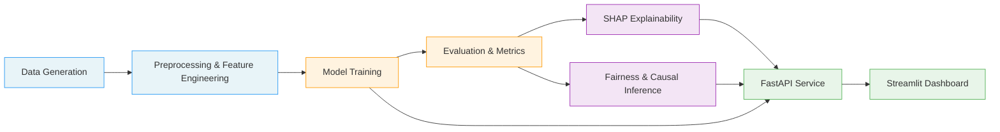
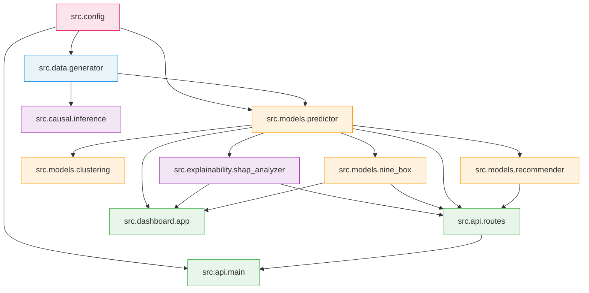
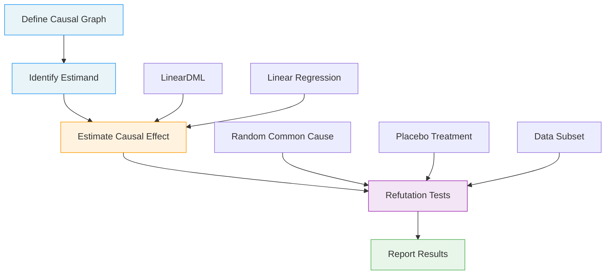

# Architecture

This document describes the system architecture, module dependencies, and technology stack for the Employee Performance Analytics ML platform.

---

## System Overview

The platform follows a modular pipeline architecture: synthetic data generation feeds into preprocessing, model training, and evaluation, with outputs served through a REST API and an interactive dashboard.



### Pipeline Stages

1. **Data Generation** -- Synthetic HR data with realistic statistical correlations across four tables (employees, evaluations, training records, promotions).
2. **Preprocessing & Feature Engineering** -- Data cleaning, encoding, feature aggregation (training hours, promotion history), and train/val/test splitting.
3. **Model Training** -- Ensemble models (Random Forest, Gradient Boosting, XGBoost) with hyperparameter tuning and cross-validation.
4. **Evaluation & Metrics** -- Regression and classification metrics, 9-Box Grid talent classification, employee clustering.
5. **SHAP Explainability** -- Global and local feature importance analysis using SHAP (TreeExplainer) to explain model predictions.
6. **Fairness & Causal Inference** -- Causal effect estimation (DoWhy + EconML) with refutation tests for hypothesis validation.
7. **FastAPI Service** -- REST API for real-time prediction, 9-Box classification, and development recommendations.
8. **Streamlit Dashboard** -- Interactive visualisation with Plotly for performance analytics, SHAP plots, and talent grids.

---

## Module Dependencies



---

## Project Structure

```
employee-performance-analytics-ml/
├── src/
│   ├── config.py                  # Pydantic-based application settings
│   ├── data/
│   │   └── generator.py           # Synthetic data generation (4 tables)
│   ├── models/
│   │   ├── predictor.py           # Model training, evaluation, persistence
│   │   ├── nine_box.py            # 9-Box Grid talent classification
│   │   ├── clustering.py          # Employee segmentation (K-Means, DBSCAN)
│   │   └── recommender.py         # Development recommendations engine
│   ├── explainability/
│   │   └── shap_analyzer.py       # SHAP-based feature importance
│   ├── causal/
│   │   └── inference.py           # DoWhy causal effect estimation
│   ├── api/
│   │   ├── main.py                # FastAPI application factory
│   │   ├── routes.py              # API endpoints
│   │   └── schemas.py             # Pydantic request/response models
│   └── dashboard/
│       └── app.py                 # Streamlit interactive dashboard
├── data/
│   ├── raw/                       # Generated CSV files
│   └── processed/                 # Engineered features
├── models/                        # Serialised model artefacts (.joblib)
├── tests/                         # pytest test suite
├── docker/                        # Dockerfiles for API and dashboard
├── notebooks/                     # Exploratory analysis notebooks
├── docs/                          # Project documentation
├── requirements.txt               # Production dependencies
├── requirements-dev.txt           # Development dependencies
├── docker-compose.yml             # Multi-service orchestration
├── Makefile                       # Task automation
└── pyproject.toml                 # Project metadata and tool configuration
```

---

## Technology Stack

| Layer | Technology | Version | Purpose |
|---|---|---|---|
| **Language** | Python | 3.10+ | Core runtime |
| **ML Framework** | scikit-learn | >= 1.4 | Random Forest, Gradient Boosting, preprocessing pipelines |
| **Gradient Boosting** | XGBoost | >= 2.0 | High-performance gradient boosted trees |
| **Explainability** | SHAP | >= 0.44 | TreeExplainer for global and local feature importance |
| **Causal Inference** | DoWhy | >= 0.11 | Causal graph modelling, identification, and estimation |
| **Causal ML** | EconML | >= 0.15 | LinearDML and heterogeneous treatment effect estimation |
| **API Framework** | FastAPI | >= 0.110 | Async REST API with OpenAPI documentation |
| **ASGI Server** | Uvicorn | >= 0.27 | High-performance ASGI server |
| **Dashboard** | Streamlit | >= 1.32 | Interactive web-based analytics dashboard |
| **Visualisation** | Plotly | >= 5.20 | Interactive charts and plots |
| **Data Validation** | Pydantic | >= 2.6 | Request/response schemas and settings management |
| **Data Processing** | pandas | >= 2.1 | DataFrame operations and data manipulation |
| **Numerical** | NumPy | >= 1.25 | Array operations and statistical computations |
| **Serialisation** | joblib | >= 1.3 | Model persistence and caching |
| **Synthetic Data** | Faker | >= 24.0 | Realistic name and date generation |
| **Logging** | Loguru | >= 0.7 | Structured logging with levels and formatting |
| **HTTP Client** | httpx | >= 0.27 | Async HTTP requests (dashboard to API) |
| **Containerisation** | Docker | latest | Application packaging and deployment |
| **Orchestration** | Docker Compose | latest | Multi-service container management |
| **Linting** | Ruff | >= 0.3 | Fast Python linter and formatter |
| **Type Checking** | mypy | >= 1.8 | Static type analysis |
| **Testing** | pytest | >= 8.0 | Test framework with coverage reporting |
| **CI/CD** | GitHub Actions | -- | Continuous integration pipeline |

---

## 9-Box Grid Methodology

The platform implements the McKinsey 9-Box talent matrix, which classifies employees along two axes:

- **Performance** (x-axis): measured by `performance_score` (1.0--5.0)
- **Potential** (y-axis): measured by `potential_score` (1.0--5.0)

Each axis is divided into three tiers (Low, Medium, High) using configurable thresholds (default: 2.5 and 3.5), producing nine classification boxes:

|  | **Low Performance** | **Medium Performance** | **High Performance** |
|---|---|---|---|
| **High Potential** | Inconsistent Player (7) | High Potential (4) | Star (1) |
| **Medium Potential** | Development Needed (8) | Core Player (5) | High Performer (2) |
| **Low Potential** | Under Performer (9) | Average Performer (6) | Solid Performer (3) |

Each box maps to a tailored development recommendation (see `docs/nine_box_methodology.md` for details).

---

## Causal Inference Approach

The causal analysis module uses **DoWhy** for causal graph specification, identification, and estimation, with **EconML** (LinearDML) for heterogeneous treatment effect estimation.

### Pipeline



### Predefined Hypotheses

1. **Training hours improve performance** -- Treatment: `total_training_hours`, Outcome: `performance_score`
2. **Excessive overtime reduces performance** -- Treatment: `overtime_hours`, Outcome: `performance_score`
3. **Manager rating predicts future performance** -- Treatment: `manager_rating`, Outcome: `performance_score`
4. **Tenure influences performance** -- Treatment: `tenure_years`, Outcome: `performance_score`

### Refutation Methods

Each causal estimate is validated using three refutation tests:

- **Random Common Cause** -- Adds a random confounding variable; the estimate should remain stable.
- **Placebo Treatment** -- Replaces the treatment with random noise; the estimated effect should approach zero.
- **Data Subset** -- Re-estimates on random subsets; the effect should remain consistent.

Bootstrap confidence intervals (200 iterations) and p-values provide statistical significance measures for each estimated effect.
